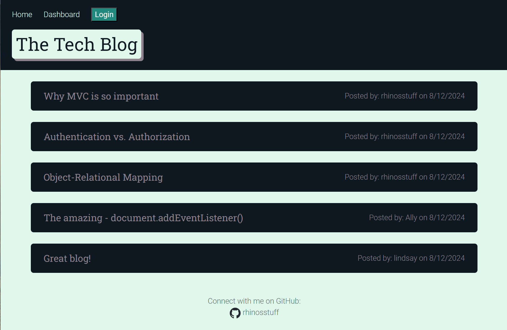
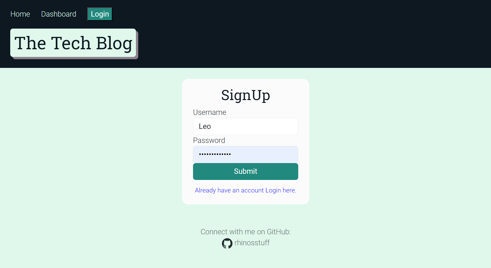
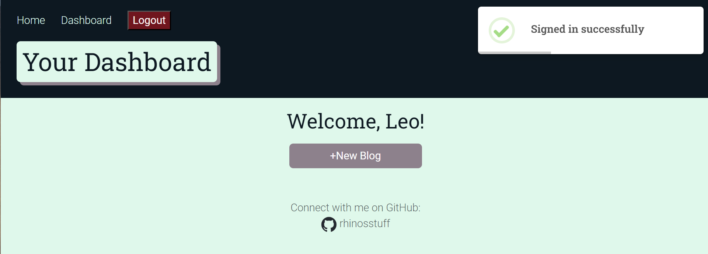
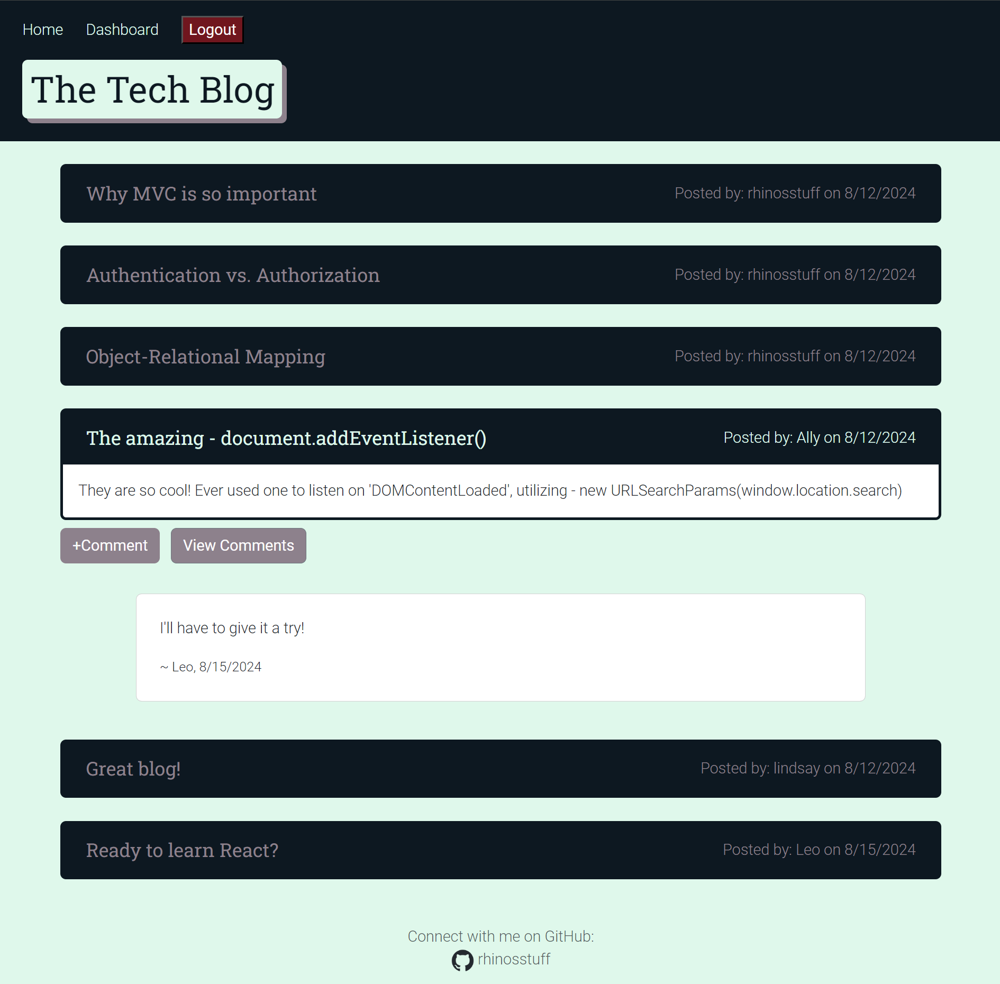

  # Tech-Blog
  [](./LICENSE)

  ## Description
  This is my 14-Challenge. In this challenge I had to create everything from scratch. I was given specific parameters to accomplish. I was to create a blogging website that users have to login to perform actions and view specific pages and elements of the application. I was also to implement: Express.js, Handlebars.js, Sequelize and connect to postgreSQL database. This was one of the more challenging programs so far. I took a lot of time to understand every aspect of this project. I tried keeping my code easy to read and worked on removing redundancies. In the end it was supper enjoyable and I learned a ton doing this on my own. 

  ## Table of Contents 
  * [Installation](#installation)
  * [Usage](#usage)
  * [License](#license)
  * [Contributing](#contributing)
  * [Tests](#tests)
  * [Questions](#questions)

  ## Installation
  To install necessary dependencies, run the following command:  
  ```
  npm i
  ```  
   >If wanting to run this locally, you will need the secret value held by me.  
  Then follow these steps:  
  >
  >Login to postgres: `psql -U “your-username”`  
  In postges create database `\i db/schema.sql`  
  Go back to terminal, seed the database: `npm run seed`  
  In terminal `node server.js` to view http://localhost:3001/ 

  ## Usage
  *** **[Click Here - For Deployed Application](https://tech-blog-6pus.onrender.com/)** ***

  This is a easy to use blog and comment application. You can view all blogs and comments as a guest. If you would like to write a blog or post a comment you will need to login or signup first. Once logged in you will be able to see all your blogs and can choose to edit or delte them. You can also go to the homepage and add a comment to other user blogs.  

  Here are some images of what to expect.  

  Homepage:  
    

  Signup:  
    

  User Dashboard:  
       

  View Comments:  
    
  
  ## License
  This project is licensed under the **[MIT](./LICENSE)** license.

  ## Contributing
  N/A

  ## Tests
  To run tests, run the following command:
  ```    
  N/A
  ```
  ## Questions
  If you have any questions about the repo, open an issue or contact me directly at **rhinosstuff@gmail.com**.
  
  You can explore my other projects on GitHub **[rhinosstuff](https://github.com/rhinosstuff)**.
  
  